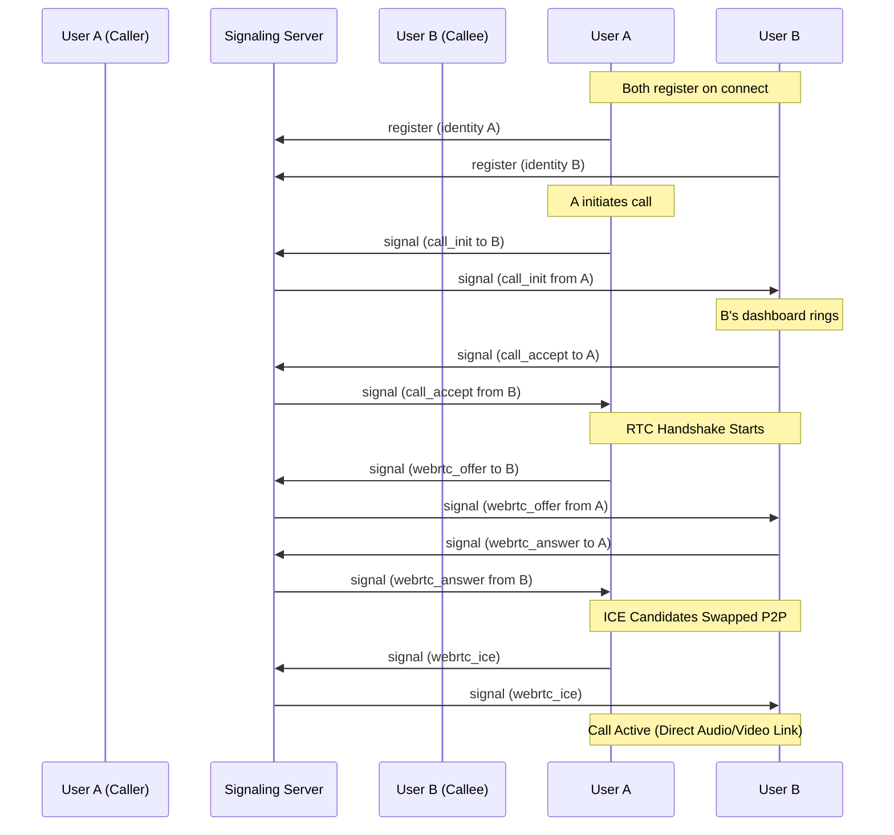

# Real-Time Calling System Integration Guide

This directory contains the self-contained files required to integrate real-time WebRTC audio/video calling into any other frontend dashboard. 

WebRTC media streams are established peer-to-peer (directly browser-to-browser). The Node.js signaling server is only used to establish connection handshakes (exchanging SDP offers, answers, and ICE candidates).

---

## 📂 Directory Structure

```text
calling-system/
├── client/
│   ├── context/
│   │   └── CallContext.tsx     # Context provider for signaling & peer connection state
│   ├── components/
│   │   └── CallOverlay.tsx     # Global overlay UI (dialing, ringing, active call screen)
│   └── views/
│       └── VideoCall.tsx       # "Quick Dial" dashboard panel
├── server/
│   ├── package.json            # Server package definition
│   └── server.js               # Standalone Socket.IO signaling relay server
└── README.md                   # This integration guide
```

---

## ⚡ Backend Integration (Signaling Relay)

The backend handles registration and relays signal events from one socket client to another.

### 1. Setup & Installation
Go to the `server/` directory and install the necessary dependencies:
```bash
cd server
npm install
```

### 2. Running the Server
```bash
npm start
```
By default, the signaling server listens on `http://localhost:5001`. You can specify a different port using the `PORT` environment variable:
```bash
PORT=8080 npm start
```

---

## 💻 Frontend Integration (React & TypeScript)

Follow these steps to plug the calling client into your existing dashboard application.

### 1. Install Dependencies
You need `socket.io-client` for signaling and `lucide-react` for icons:
```bash
npm install socket.io-client lucide-react
```

### 2. Add Environment Variable
Add the signaling server URL to your client's `.env` configuration file (Vite default shown):
```env
VITE_SIGNALING_URL=http://localhost:5001
```

### 3. Wrap App in the Provider
Import `CallProvider` and wrap your main layout/app component. The provider requires:
- `selfId`: A unique string identifier representing the logged-in user (e.g. `user.role` or `user.id`).
- `selfName`: Display name of the current user.

Example (in `App.tsx` or `index.tsx`):
```tsx
import { CallProvider } from './context/CallContext';
import { CallOverlay } from './components/CallOverlay';

function App() {
  const currentUser = { id: "new-delhi-dm", name: "Alice Vaz (New Delhi DM)" };

  return (
    <CallProvider selfId={currentUser.id} selfName={currentUser.name}>
      <MainLayout>
        {/* Your application content here */}
      </MainLayout>
      
      {/* Call overlay renders globally when a call starts or comes in */}
      <CallOverlay />
    </CallProvider>
  );
}
```

### 4. Trigger Calls from Components
Any component inside the provider can initiate a call using the `useCall` hook.

```tsx
import { useCall } from '../context/CallContext';

export const MyComponent = () => {
  const { startCall, callState } = useCall();

  const handleDial = () => {
    // startCall takes a recipient object: { id, name } and a call type: 'audio' | 'video'
    startCall(
      { id: 'chief-minister', name: 'Office of Chief Minister' },
      'video'
    );
  };

  return (
    <button onClick={handleDial} disabled={callState !== 'idle'}>
      Call Chief Minister
    </button>
  );
};
```

---

## 📡 WebRTC Signaling Workflow


